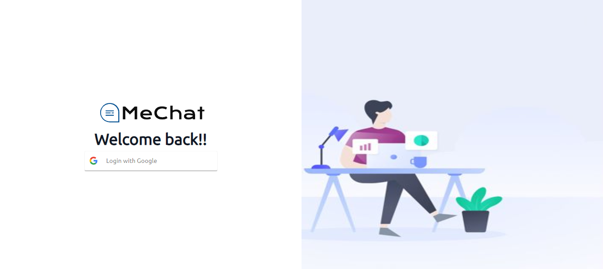
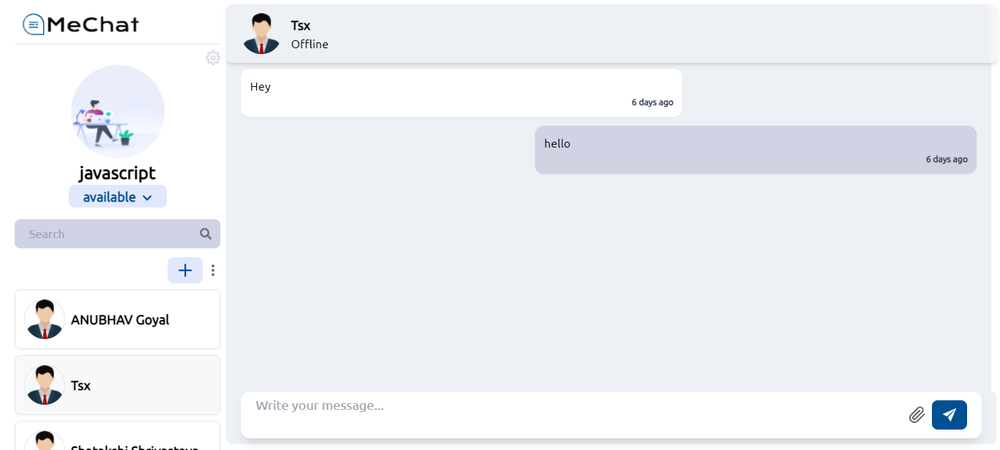
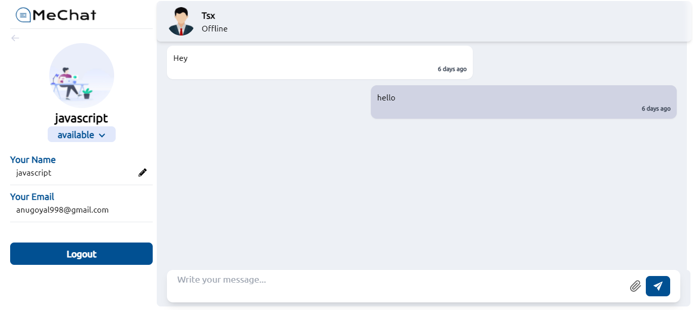
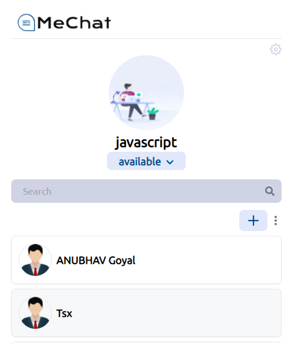
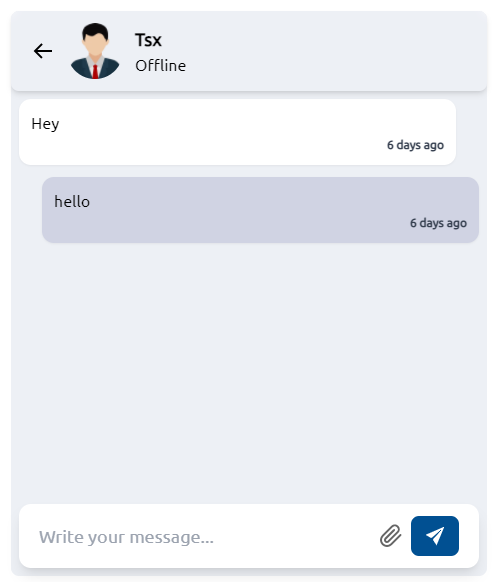

# MeChat
  

**MeChat**, A Realtime chat application with cool UI, and Realtime messaging.

**Features:**
* Realtime messaging 
* Chat with every user
* Google Login
* Edit profile

Website Link: [MeChat](https://chat-app-sandy-eta.vercel.app/)


### Tech Stack
* HTML/CSS
* Javascript
* React
* Tailwind CSS
* Redux
* Nodejs/Expressjs
* MongoDB
* Socket.io

### Client Side
#### `npm install`
Install modules mentioned in package.json
#### `Create .env`
Create a .env file in the client folder and add following in it
```
REACT_APP_GCID=<Your Google Client ID>
REACT_APP_CLOUDINARY_API=<Your Cloudinary API key>
REACT_APP_CLOUD_NAME=<Your Cloudinary cloud name>
REACT_APP_API_URL=<Your Backend URL>
```
#### `npm start`
Runs the app in the development mode.  
Open http://localhost:3000 to view it in the browser.  

The page will reload if you make edits.
You will also see any lint errors in the console.
#### `npm run build`
Builds the app for production to the build folder.  
It correctly bundles React in production mode and optimizes the build for the best performance.

The build is minified and the filenames include the hashes.  
Your app is ready to be deployed!

See the section about [deployment](https://facebook.github.io/create-react-app/docs/deployment) for more information.  
#### `npm run eject`
**Note: this is a one-way operation. Once you `eject`, you can’t go back!**  

If you aren’t satisfied with the build tool and configuration choices, you can `eject` at any time. This command will remove the single build dependency from your project.

### Server Side
#### `npm install`
Install modules mentioned in package.json
#### `Create .env`
Create .env file in server folder and paste following in it
```
DB_URL=<Your MongoDB Database URL>
FRONTEDN_URL=<Your Frontend URL>
HASH_SECRET=<Any Random String>
JWT_ACCESS_TOKEN_SECRET=<Any Random String>
JWT_REFRESH_TOKEN_SECRET=<Any Random String>
```
### `npm start`

Runs the app in the development mode.  
Open [http://localhost:5000](http://localhost:5000) to run server.  

You will also see any errors or information in the console


### Screenshots

###### Login Page


###### Home Page


###### Edit Profile


###### Mobile Screen



